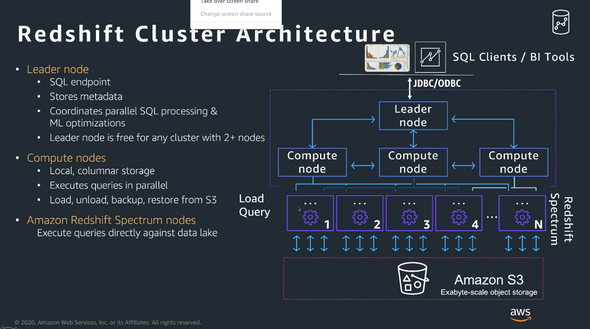

##Redshift Cluster Architecture

shared notihg 구조  
Compute node는 서로 뭐하는지 모름  

Redshift Spectrum
1. S3에 있는 데이터를 바로 연결(CSV 데이터)
2. 그냥 쿼리를 날리듯이 사용할 수 있다.
3. S3에 있는 데이터를 넣어주고(Oracle에 있는 Dump?). S3에서 올리는 작업을 없앨수 있다.(지연을 줄일수 있다.)
---

##Evolving Architecture(RA3 Managed Storage)
