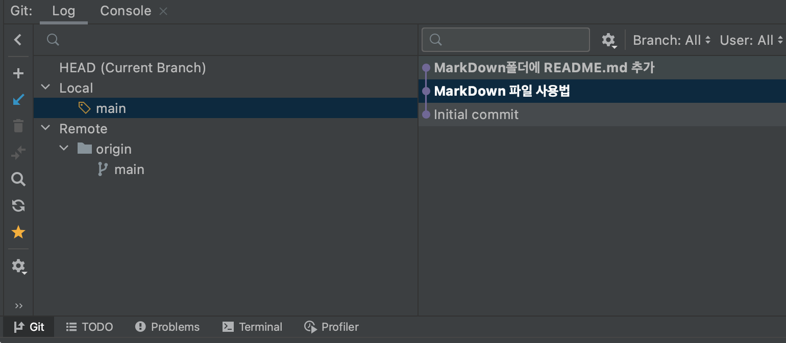
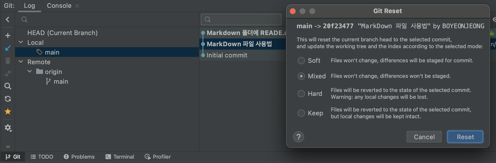
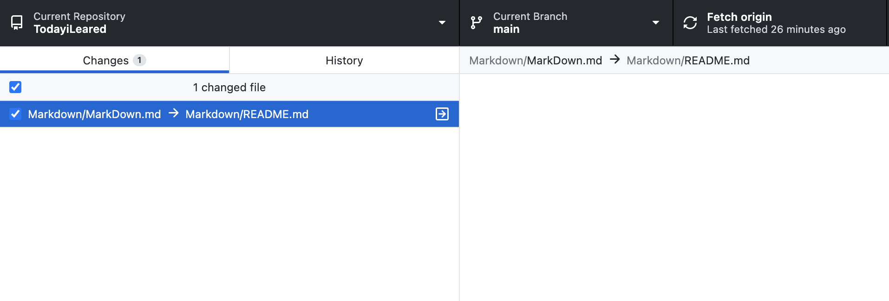
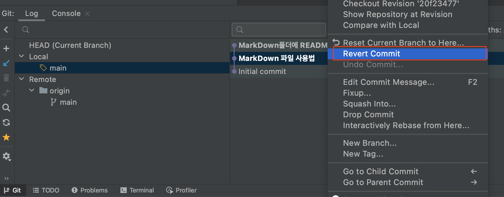

## 커밋을 취소해보자

깃에서 커밋을 했을때 커밋을 취소하고 싶은 경우가 발생한다. 이 경우 많은 주니어 개발자들이 당황하기도 하고 강제 reset 후 푸쉬하여 이전 코드를 날려버리기도 한다. 오늘은 커밋을 취소하는 방법과, IntelliJ Tool에서 직접 실습해보는 시간을 가져보도록 할것이다.

먼저 커밋을 취소하는 방법에는 Reset, Revert 두가지가 있다.

1. Reset : 과거의 특정 Commit을 **삭제**한다.

2. Revert : Commit은 그대로 두고, Commit을 취소하겠다는 추가 Commit을 한다.

---

## Reset과 Revert의 장단점을 살펴보자

위의 두가지의 방법은 장단점이 있다.

1. Reset : 커밋 히스토리가 깔끔해진다. 하지만 협업시 이전 타인의 기록을 삭제하거나, 충돌을 발생시킬수 있다.

2. Revert : 커밋 히스토리가 좀 더러워 질수 있다. 하지만 어떤 문제가 있었는지 확인이 가능하다. 또한, 협업시 삭제하거나 충돌될 확률을 낮춰준다.

따라서 Reset은 혼자 개발하는 프로젝트나 브랜치를 사용할때 이 커밋기록을 지워도 전혀 문제가 발생하지 않는 다는 보장이 있다면 사용하면 좋고, 협업을 하고 있거나 해당 커밋 기록을 지웠을 경우 문제가 발생할 확률이 있다면 Revert를 사용해야 한다.

---

## 먼저 Reset에 대해 자세히 알아보자

Reset은 총 3가지의 모드가 존재한다.

1. soft : 파일을 staging area 로 돌려놓음.  > commit 하기 전 상태

2. mixed(default) : 파일을 working directory로 돌려놓음 > add 하기 전 상태

3. hard : 파일들 중 tracked 파일들을 working directory에서 삭제

그리고 취소할 커밋의 수도 선택할 수 있다. 모드는 위의 3가지중 defult값이 mixed로 진행된다.

1. HEAD~n : 현재로부터 n 만큼

2. HEAD : 가장 최근 커밋만

```
git reset --soft [commit ID] 
git reset --mixed [commit ID]
git reset --hard [commit ID]
git reset HEAD~10 
git reset HEAD^
```

---

## IntelliJ 에서 Reset에 해보자

1.하단의 Git 을 클릭하고 원하는 브랜치의 커밋 기록을 연다.



2.돌아가고자 하는 커밋의 오른쪽 마우스를 클릭하여 Reset Current Branch to Here... 을 클릭한다.


3. 모드 4개중에 원하는 모드를 클릭한다.
   


4. soft 모드를 선택했기 때문에 reset 하고자 했던 파일이 그대로 남아있다.



---

## 다음으로 Revert에 대해 자세히 알아보자

Revert는 보다 단순하다. 단순하게 돌아가고자 하는 commit ID만 기록해주면 된다.

```
git revert [commit ID]
```

---

## IntelliJ 에서 Revert에 해보자

1.마찬가지로 하단의 Git에 들어간후 원하는 브랜치의 commit history를 연다


 
2. 돌아가기를 원하는 커밋의 오른쪽 마우스를 누른후 Revert Commit 버튼을 클릭한다.



---

[출처] : https://bo-yeon.tistory.com/102