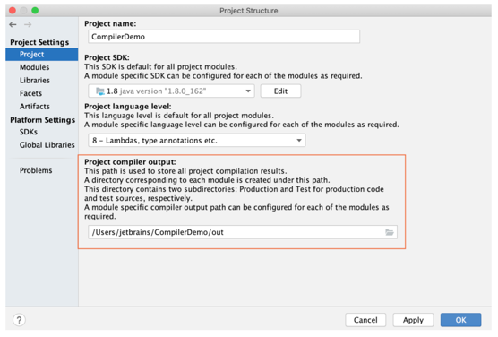
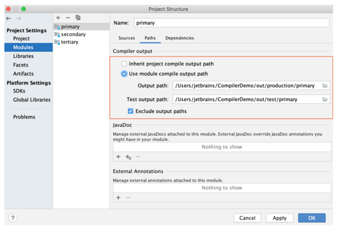

##Compile and build applications with IntelliJ IDEA

The IntelliJ IDEA compilation and building process compiles source files and brings together external libraries, properties files, and configurations to produce a living application. IntelliJ IDEA uses a compiler that works according to the Java specification.

You can compile a single file, use the incremental build for a module or a project, and rebuild a project from scratch.

If you have a pure Java or a Kotlin project we recommend that you use IntelliJ IDEA to build your project since IntelliJ IDEA supports the incremental build which significantly speeds up the building process.

However, IntelliJ IDEA native builder might not correctly build the Gradle or Maven project if its build script file uses custom plugins or tasks. In this case, the build delegation to Gradle or Maven can help you build your project correctly.

IntelliJ IDEA 컴파일 및 빌드 프로세스는 소스 파일을 컴파일하고 외부 라이브러리, 속성 파일 및 구성을 함께 가져와 살아있는 응용 프로그램을 생성합니다. IntelliJ IDEA는 Java 사양에 따라 작동하는 컴파일러를 사용합니다.

단일 파일을 컴파일하고, 모듈 또는 프로젝트에 대한 증분 빌드를 사용하고, 프로젝트를 처음부터 다시 빌드할 수 있습니다.

순수 Java 또는 Kotlin 프로젝트가 있는 경우 IntelliJ IDEA가 빌드 프로세스 속도를 크게 높이는 증분 빌드를 지원하므로 IntelliJ IDEA를 사용하여 프로젝트를 빌드하는 것이 좋습니다.

그러나 IntelliJ IDEA 기본 빌더는 빌드 스크립트 파일이 사용자 정의 플러그인 또는 작업을 사용하는 경우 Gradle 또는 Maven 프로젝트를 올바르게 빌드하지 않을 수 있습니다. 이 경우 Gradle 또는 Maven에 대한 빌드 위임은 프로젝트를 올바르게 빌드하는 데 도움이 될 수 있습니다.

---

##Change the compilation output locations
When you compile your source code, IntelliJ IDEA automatically creates an output directory that contains compiled .class files.
Inside the output directory, IntelliJ IDEA also creates subdirectories for each of your modules.

The default paths for subdirectories are as follows
1. Sources: <ProjectFolder>/out/production/<ModuleName>

2. Tests: <ProjectFolder>/out/test/<ModuleName>

At the project level, you can change the <ProjectFolder>/out part of the output path. If you do so (say, specify some <OutputFolder> instead of <ProjectFolder>/out) but don't redefine the paths at the module level, the compilation results will go to <OutputFolder>/production/<ModuleName> and <OutputFolder>/test/<ModuleName>.

At the module level, you can specify any desirable compilation output location for the module sources and tests individually.

소스 코드를 컴파일할 때 IntelliJ IDEA는 컴파일된 .class 파일이 포함된 출력 디렉터리를 자동으로 만듭니다. IntelliJ IDEA는 출력 디렉토리 내에서 각 모듈에 대한 하위 디렉토리도 생성합니다.

하위 디렉토리의 기본 경로는 다음과 같습니다.
1. 출처: /out/production/
2. 테스트: /out/test/

프로젝트 수준에서 출력 경로의 /out 부분을 변경할 수 있습니다. 그렇게 하고(예: /out 대신 일부 지정) 모듈 수준에서 경로를 재정의하지 않으면 컴파일 결과가 /production/ 및 /test/로 이동합니다.

모듈 수준에서 모듈 소스 및 테스트에 대해 원하는 컴파일 출력 위치를 개별적으로 지정할 수 있습니다.

1. Project 탭에서 Project의 compiler output 지정

   

2. Module 탭에서 각 Module compiler output 지정의

---

##Build
When you execute the Build the Build Project icon command, IntelliJ IDEA compiles all the classes inside your build target and places them inside the output directory.

When you change any class inside the build target and then execute the build action, IntelliJ IDEA performs the incremental build that compiles only the changed classes. IntelliJ IDEA also recursively builds the classes' dependencies.

https://www.jetbrains.com/help/idea/compiling-applications.html